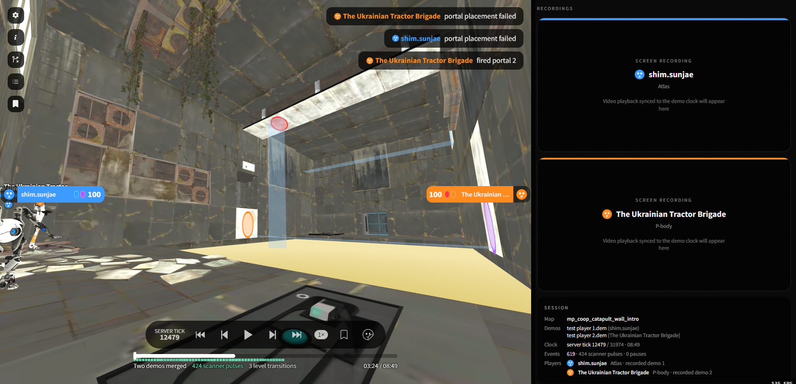

## Portal 2 Co-op Demo Replay in Browser / rhubarb.portal

View Portal 2 co-op demo files (`.dem`) directly in the browser: both bots, their portals, cubes, floor buttons, doors and lasers replayed in a 3D view, with the events of the session (portal shots and traversals, chat, console commands, pauses, level transitions, scanner pulses) on a shared timeline. A session is loaded from one player's first-person demo, or from both players' demos of the same session, which are merged on the server tick clock.

The 3D viewport takes the left two thirds of a widescreen page. The right third holds the placeholders for the two players' screen recordings, which a later version plays back in sync with the demo clock.

This is a fork of [dribble.tf](https://github.com/bryjch/dribble.tf) with the Team Fortress 2 parsing, models and UI replaced. The demo parser is a TypeScript port of the Portal 2 co-op parser in [gallantlab/DemoFiles](https://github.com/gallantlab/DemoFiles) (`src/demofiles`), which follows [NeKzor/sdp](https://github.com/NeKzor/sdp) for the demo format and [UncraftedName/UntitledParser](https://github.com/UncraftedName/UntitledParser) for entity decoding. The plan, the deviations from the Python reference and the remaining work are in `specs/portal2-coop-replacement.md`.



### Running

```
npm install --legacy-peer-deps
npm run dev
```

`--legacy-peer-deps` is needed because `postprocessing` declares a peer dependency on an older `three`. `npm run build` writes the production bundle to `dist/`, and `npx tsc --noEmit` typechecks the project.

Drop one or two `.dem` files onto the page, or open a session by link with `/?demoUrl=<demo url>&demoUrl2=<partner demo url>&tick=<axis row>`. The About panel loads `public/samples/portal2_coop.dem`, the public co-op demo from NeKzor/sdp (MIT, see `public/samples/portal2_coop.LICENSE.txt`).

### Validating the parser

The parser modules run under Node without a bundler:

```
node --experimental-strip-types scripts/portal2/dump-demo.mts <demo.dem> [<partner demo.dem>]
```

The script prints the header, frame and message inventories, string tables, game events, the players and their first recorded state, and, with a partner demo, the merged server tick axis. The expected values for the public sdp demos are listed in section 6 of the spec.

### Credits

- [dribble.tf](https://github.com/bryjch/dribble.tf) by [@bryjch](https://github.com/bryjch) - the viewer this project is forked from
- [DemoFiles](https://github.com/gallantlab/DemoFiles) - the Portal 2 co-op parser this port follows
- [sdp](https://github.com/NeKzor/sdp) by [@NeKzor](https://github.com/NeKzor) and [UntitledParser](https://github.com/UncraftedName/UntitledParser) by [@UncraftedName](https://github.com/UncraftedName) - demo format and entity decoding references
- [three.js](https://threejs.org) and [react-three-fiber](https://github.com/pmndrs/react-three-fiber) - 3D rendering
- [react-canvas-draw](https://github.com/embiem/react-canvas-draw) by [embiem](https://github.com/embiem) - canvas drawing tools
